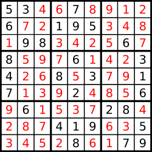
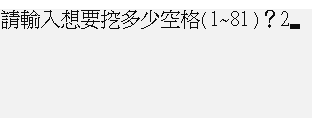
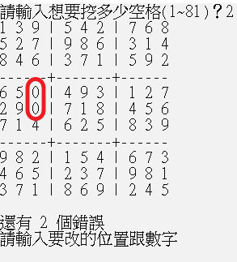

<!-- _paginate: false -->
<!--_backgroundColor: lightBlue -->

第一次  數獨報告
=== 

---

系級班級
---
資工二Ａ & 資工三Ａ

組別號碼
---
第九組

---

成員資訊
---
陳任璿(組長)   王翌權   宋承哲

---

程式介紹
---
我們使用了四個類別，分別是
1.生成 (Generate)
2.挖空 (Blank)
3.填空 (FillBlank)
4.解答 (Answer)

---

| Generate |
| :--- |
| + `Generate()`  + `void generator()`  + `vector<int > get_board()`  + `bool check_rep(vector<int>,int,int)`  + `bool board_put(vector<int>&)`|
| - `int new_board[][]`  - `int i,j,k,l` |

---

| Blank |
| :-- |
| + `void receive_board(vector <int>)`  + `void hole_board(int)`   + `vector<int> return_board()`|
| - `vector<int> revise_board`  - `int Hollow_quantity`|

---

---

程式規則
---

###### 「數獨」 的規則, 就是以1∼9九個數字把9×9方格裡的空格填滿, 1∼9的數字在每 個直行、橫列及每個小九宮格裡都只能出現一次。想解開「數獨」不需任何的計算, 而是利用邏輯推解出答案。 

---

程式玩法
---
執行後，會要輸入一個數字，用來挖數獨的空格
再來就是開始填空解數獨

---

程式碼如何安裝執行
---
把程式碼丟到編譯器

---

程式碼執行方式
---
把程式碼丟到編譯器

---

程式畫面截圖
---

---
**輸入數字**

---
**產生挖空後的棋盤**

---

---

分工資訊
---

陳任璿:編輯程式、ppt製作
宋承哲:編輯程式、報告(消失)
王翌權:編輯程式
